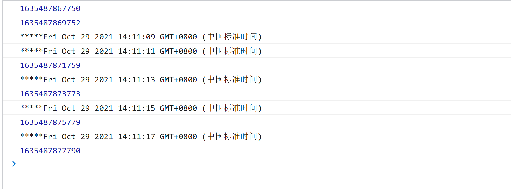

### 共同点
都是再一段时间后执行相应的js代码

### 区别
- setTimeout 默认只执行一次
- setInterval 每隔一段时间就会执行一次
```js
  function showTime() {
    console.log(+ new Date())
    setTimeout(showTime, 2000)
  }
  showTime()
  function showTime2() {
    setInterval(() => {
      console.log('*****' + new Date())
    }, 2000)
  }
  showTime2()
```


虽然先执行了setTimeout，但是后面每一次都先打印setInterval,setInterval 就是肯定会在规定的时间内执行，更为准确，而setTimerout则是会等代函数的执行时间，则会有一些偏差